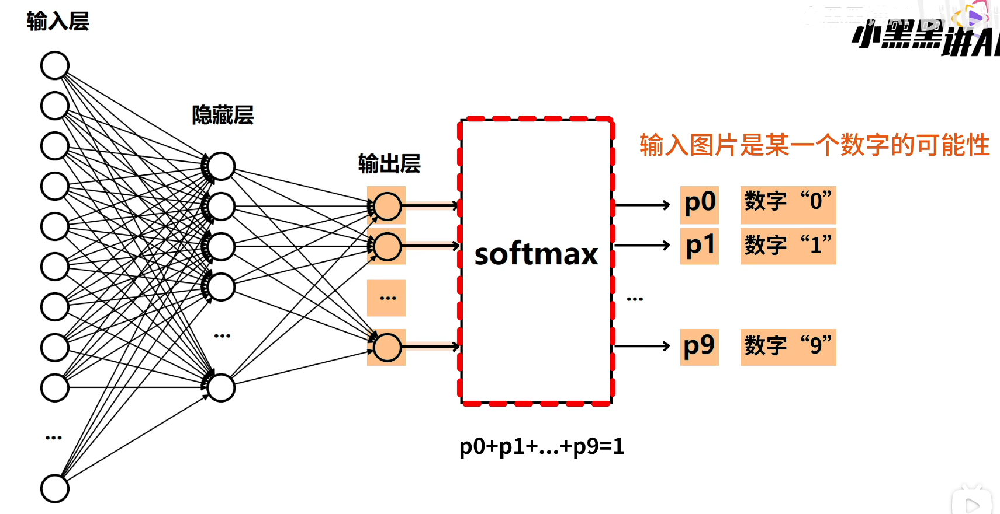

# Neural Network

神经网络并不复杂，它包含了输入层、隐藏层和输出层三个部分。从输入层到隐藏层，以及隐藏层到输出层都是对数据的线性变换，
而隐藏层是对数据的非线性变换。经过三个步骤，就把一个输入给映射到可能的结果上了。

而我们要设计并训练一个神经网络，实际上只需要三步：1.设计神经网络结构(输入层与输出层固定,自由定义隐藏层);2.准备训练数据集和测试数据集;3.对模型经行训练和测试。就可以初步得到一个自己的神经网络模型了

- 设计神经网络结构，定义神经网络
  1. 定义线性层layer 
  分别在输入层与隐藏层之间，以及隐藏层与输出层之间设置线性层(如果有多个隐藏层，要在每个隐藏层之间设置线性层)`self.layer1 = nn.Linear(784,256)`
  2. 定义前向传播函数forward() 
  明确数据在神经网络中传递的过程，以及在隐藏层的非线性变化

- 训练/测试数据的准备和处理
  1. 数据的获取  
  从数据集网站获取数据集，并分别保存为训练数据集train和测试数据集test
  2. 数据预处理 
  目的是将原始数据转换为适合模型训练的规范化形式，从而提升模型的学习效率、稳定性和最终性能
  3. 初始化数据集 
  构建数据集`dataset`将数据`data`与标签`label`配对，标签相当于训练的标准答案
  4. 小批量数据读取 
  读取数据要将数据小批量读入而不是全载入主要原因有二：一是硬件的制约，有限的内存与GPU显存无法直接处理动辄百万级的数据。二是优化效率与收敛性能，全批量计算梯度虽然方向准确，但计算成本高、速度慢；单样本计算梯度噪声大，训练不稳定，无法完全榨取GPU算力。所以合理设计的小批量数据读入是最优选择

- 模型的训练和测试
  1. 数据预处理和读入 
  同上一部分所讲
  2. 训练前的三个对象 
  模型本身`model = Network()` 
  优化器：优化模型中参数`optimizer = optim Adam(model.parameters())` 
  损失函数：量化了模型预测值与真实值之间的差距，用于训练，指导模型迭代时参数更新。必须是可微分的，以便计算梯度。`criterion = nn.CrossEntropyLoss()`
  3. 模型迭代 
  两层循环，外层循环是迭代的次数，可自定义；内层循环每次经行一次小批量数据读取，每循环一次就进行一次梯度下降算法，包括了5个步骤
  - 计算神经网络前向传播结果`output`
  - 计算`output`和标签`label`之间的损失`loss`
  - 使用`backward`计算梯度
  - 使用`optimizer.step`更新参数
  - 将梯度清零 
  每迭代一定次数的小批量，就打印一次模型的损失，观察训练的过程 
  保存模型
  4. 模型测试 
  测试流程与训练流程差不多，就是要保存正确识别的数量，记录错误结果，并算出正确率 

